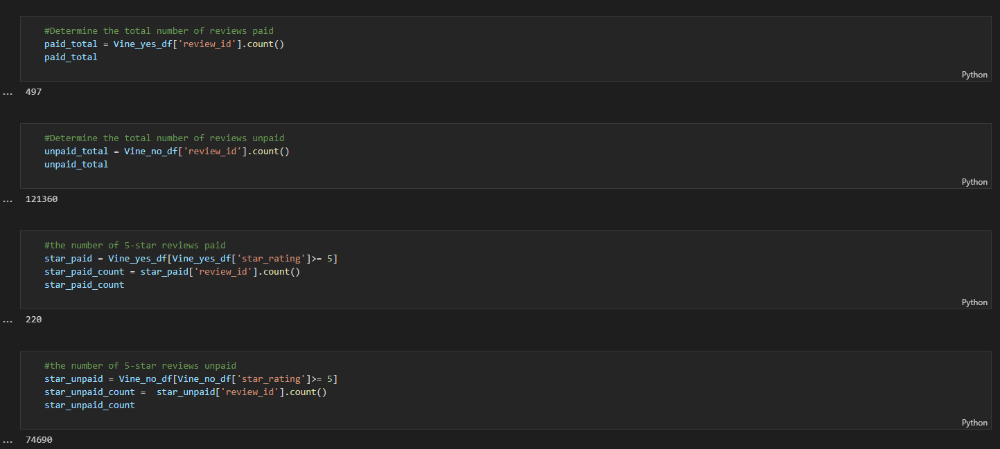
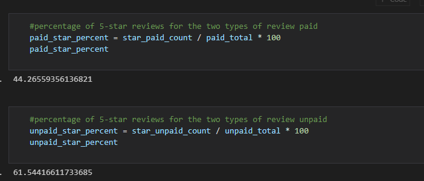

# Amazon_Vine_Analysis

## Overview
Amazon Vine is a program that pays members to write reviews.
SellBy, a company were are working with, pays a small fee to Amazon Vine.

Using: Postgres, AWS RDS, Python (Jupyter notebook), and Google Colab

## Results
 

**D2.1** *Total Counts of paid, unpaid, and then paid 5 star reviews and unpaid 5 star reviews*

 

**D2.2** *Percent of paid 5 star reviews versus unpaid 5 star reviews*

- **How many Vine reviews and non-Vine reviews were there?**
    - Paid: 497
    - Unpaid 121,360
- **How many Vine reviews were 5 stars? How many non-Vine reviews were 5 stars?**
    - Paid 5-star reviews: 220
    - Unpaid 5-star reviews: 74,690
- **What percentage of Vine reviews were 5 stars? What percentage of non-Vine reviews were 5 stars?**
    - Paid 5-star reviews percentage: ~44%
    - Unpaid 5-star reviews percentage: ~62%

## Summary
The percentage of unpaid reviews is higher at *62 percent* than paid reviews at *44 percent* through the Vine Program. With the limited data as the different between paid and unpaid is significant, it seems that paying for the service yields less postitivity bias. 
Note: This was determined after removing the total votes (helpful or not) under 20.

Specific to what we can do with python, I could check the other reviews such as 4 stars with the 5 stars, and compare that to 3 stars which is more neutral and 1&2 stars which would be seen as negative. 
This would also focus on paid versus unpaid and I could see if there are more 4s with the Vine program.

If that data shows there are less postive reviews, then it might not be worth the service of paying for Amazon Vine. 
It also could show that SellBy needs to work on their products as even with paid reviews they are doing poorly.

## Additional resources used for Python (see cells)
https://www.py4u.net/discuss/156627
https://www.geeksforgeeks.org/ways-to-filter-pandas-dataframe-by-column-values/